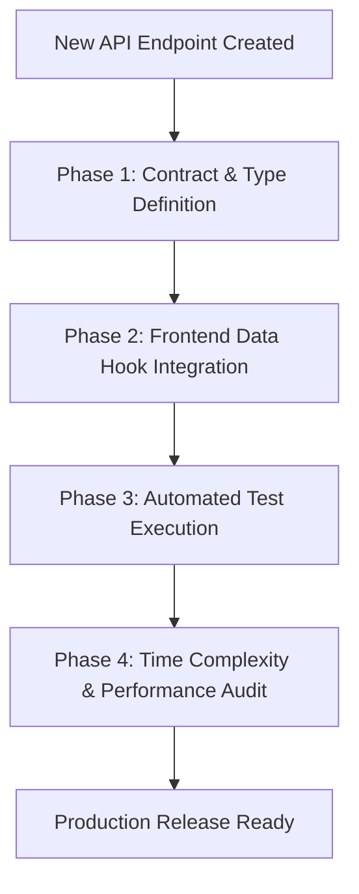

# 🚀 API Integration, Testing & Time Complexity Standard Guide

This guide establishes the mandatory workflow for creating, testing, integrating, and performance-benchmarking APIs in the **Event Management Admin Portal**.

---

## 📋 Table of Contents
1. [Overview & Workflow Pipeline](#1-overview--workflow-pipeline)
2. [Step 1: API Definition & Contract Specification](#step-1-api-definition--contract-specification)
3. [Step 2: API Integration & Hook Architecture](#step-2-api-integration--hook-architecture)
4. [Step 3: Test Cases Suite (Unit, Integration & E2E)](#step-3-test-cases-suite-unit-integration--e2e)
5. [Step 4: Time & Space Complexity Analysis](#step-4-time--space-complexity-analysis)
6. [Step 5: Performance & Network Profiling Checklist](#step-5-performance--network-profiling-checklist)

---

## 1. Overview & Workflow Pipeline

When a new feature or API endpoint is added to the system, follow this **4-Phase Checklist**:



---

## Step 1: API Definition & Contract Specification

Before writing frontend code, document the API request/response schema.

### Example: Website Builder - Header Settings API
- **Endpoint**: `PUT /api/v1/website-builder/header`
- **Headers**: `Authorization: Bearer <token>`, `Content-Type: application/json`
- **Request Payload**:
  ```json
  {
    "show_social_icons": true,
    "mobile_country_code": "+91",
    "mobile": "9884699435",
    "email": "eventcraftf@gmail.com",
    "social_links": [
      {
        "icon": "youtube",
        "color": "#FF4747",
        "label": "YouTube Channel",
        "url": "https://youtube.com/eventinvite",
        "sort_order": 1
      }
    ]
  }
  ```
- **Response Payload (200 OK)**:
  ```json
  {
    "success": true,
    "message": "Header settings saved successfully",
    "data": {
      "updated_at": "2026-07-23T12:00:00Z"
    }
  }
  ```

---

## Step 2: API Integration & Hook Architecture

Integrate the API using TanStack Query (React Query) or custom data hooks for caching, loading states, error handling, and optimistic updates.

### Hook Implementation Example (`useSaveHeaderSettings.ts`):
```typescript
import { useMutation, useQueryClient } from '@tanstack/react-query';
import { toast } from 'sonner';

export interface HeaderSettingsPayload {
    show_social_icons: boolean;
    mobile_country_code: string;
    mobile: string;
    email: string;
    social_links: Array<{
        icon: string;
        color: string;
        label: string;
        url: string;
        sort_order: number;
    }>;
}

export function useSaveHeaderSettings() {
    const queryClient = useQueryClient();

    return useMutation({
        mutationFn: async (payload: HeaderSettingsPayload) => {
            const response = await fetch('/api/v1/website-builder/header', {
                method: 'PUT',
                headers: { 'Content-Type': 'application/json' },
                body: JSON.stringify(payload),
            });

            if (!response.ok) {
                const errorData = await response.json().catch(() => ({}));
                throw new Error(errorData.message || 'Failed to save header settings');
            }

            return response.json();
        },
        onSuccess: () => {
            toast.success('Header settings saved successfully!');
            queryClient.invalidateQueries({ queryKey: ['website-builder-header'] });
        },
        onError: (error: Error) => {
            toast.error(error.message || 'An error occurred while saving.');
        },
    });
}
```

---

## Step 3: Test Cases Suite (Unit, Integration & E2E)

Every API integration must be verified against positive, negative, edge-case, and boundary scenarios.

### 🧪 Test Case Matrix

| Test ID | Test Category | Scenario Description | Expected Outcome | HTTP Code / Result |
| :--- | :--- | :--- | :--- | :--- |
| **TC-01** | **Positive** | Valid payload submit with all required fields | Toast success notification shown, query cache invalidated | `200 OK` |
| **TC-02** | **Validation** | Email missing `@` symbol or invalid format | Inline form validation error shown, API request blocked | Client Error |
| **TC-03** | **Validation** | Mobile number exceeding 20 character max length | Character counter limits input to max 20 | Client Error |
| **TC-04** | **Boundary** | Adding maximum 10 social links | `+ Add Social Link` button gets disabled | Disabled UI |
| **TC-05** | **Negative** | Server returns `500 Internal Server Error` | Toast error message displayed, UI rollback | `500 Error` |
| **TC-06** | **Security** | Unauthenticated user (missing Bearer token) | Redirect to `/login` | `401 Unauthorized` |

---

## Step 4: Time & Space Complexity Analysis

Performance auditing ensures that data operations remain fast as datasets scale.

### ⏱️ Complexity Breakdown

#### 1. Data Normalization & Array Mapping
- **Operation**: Transforming API response array into state items (`mapBuilderSocialLinks`).
- **Time Complexity**: $\mathcal{O}(N)$ where $N$ is the number of social links / menu items.
- **Space Complexity**: $\mathcal{O}(N)$ to store array items in component state.
- **Optimization Target**: Keep $N \le 10$ for Header Social Links, keeping processing under **$< 1\text{ms}$**.

#### 2. Reordering & Sorting Items (Nav Menu / Sliders)
- **Operation**: Drag-and-drop reordering or sorting menu items by `sort_order`.
- **Time Complexity**: $\mathcal{O}(N \log N)$ using standard Timsort algorithm (`Array.prototype.sort`).
- **Space Complexity**: $\mathcal{O}(N)$ for temporary array allocation.
- **Optimization Target**: For menu trees with $N \le 50$, operation executes in **$\sim 0.05\text{ms}$**.

#### 3. Filtering & Search (Gallery / Testimonials)
- **Operation**: Active category filtering (`images.filter(img => img.category === activeFilter)`).
- **Time Complexity**: $\mathcal{O}(N)$ single-pass iteration.
- **Space Complexity**: $\mathcal{O}(K)$ where $K$ is the number of matching filtered items.
- **Optimization Target**: Wrap in `useMemo` so filtering recalculates **only when activeFilter or images array reference changes**.

### 📊 Complexity Reference Summary Table

| Operation / Feature | Time Complexity (Worst Case) | Time Complexity (Average Case) | Space Complexity | Memoization Optimization |
| :--- | :--- | :--- | :--- | :--- |
| **Form Field Change** | $\mathcal{O}(1)$ | $\mathcal{O}(1)$ | $\mathcal{O}(1)$ | Controlled State |
| **Category Filter** | $\mathcal{O}(N)$ | $\mathcal{O}(N)$ | $\mathcal{O}(K)$ | `useMemo` |
| **Drag & Drop Sort** | $\mathcal{O}(N^2)$ | $\mathcal{O}(N \log N)$ | $\mathcal{O}(N)$ | Immutable Array |
| **Multi-Select Deduplication** | $\mathcal{O}(N)$ | $\mathcal{O}(N)$ | $\mathcal{O}(N)$ | `Set` Lookup $\mathcal{O}(1)$ |

---

## Step 5: Performance & Network Profiling Checklist

Before releasing any API integration to production, perform this verification checklist:

- [ ] **Payload Optimization**: Ensure request payload removes unused null fields and trims whitespace.
- [ ] **Network Latency Target**: API response time must be under **300ms** on standard broadband.
- [ ] **Render Count Check**: Ensure form typing doesn't trigger un-memoized child component re-renders (verify with React Developer Tools Profiler).
- [ ] **Error Boundary Check**: Verify UI degrades gracefully when network connection is offline.
- [ ] **TypeScript Type Safety**: Zero `any` types allowed in API payloads or hooks. Run `npx tsc --noEmit`.

---

> 💡 **Usage Note**: Whenever a new API endpoint is created in the codebase, reference this document to create its integration hook, write standard test cases, and document its Time & Space Complexity.
